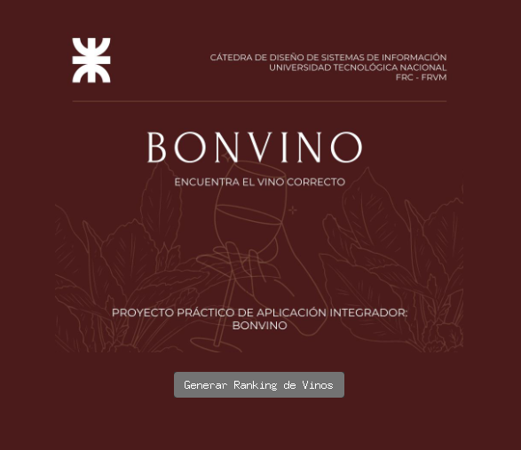
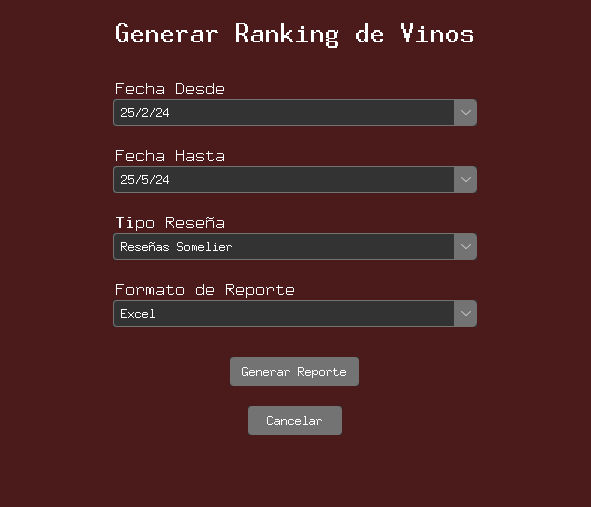

# Entrega 1

[Volver](../README.md)

---
- [Cosas a tener en cuenta](./SeguimientoEntrega1.md)
- [Lista de Tareas](./Lista_tareas.md)

---
## Consignas
Realización del caso de uso de análisis
Se tomará como referencia para el modelado, únicamente las clases del Modelo de Dominio entregado por la Cátedra y la
solución desarrollada en clase.

1. Vista de clases de análisis
Construido con un diagrama de clases.
La vista debe incluir las clases de análisis necesarias para el modelado del escenario del caso de uso asignado.
1. Vista de interacción
Modelar el escenario descripto en el caso de uso, utilizando un diagrama de secuencia. Considerar la aplicación de
los patrones GRASP de análisis.
Implementación de la realización del caso de uso de análisis
Implementar el caso de uso modelado.
Describir los detalles de la implementación mencionados a continuación:

- Lenguaje de programación utilizado (Python/Java/C# son los lenguajes a los que la cátedra da soporte)
- Framework de programación si se utiliza
- Tecnología (Web/Escritorio)
- La implementación NO de la resolución de aspectos arquitectónicos tales como:
o La conexión con la API
o El esquema de persistencia
o Las notificaciones push
o La exportación a un archivo .csv o Excel

---

*Ver Consignas Completas* : [Consignas PPAI 2024](./PPAI%202024_Consignas.pdf)

---

## Respuestas

### Caso de uso 24

- [Diagrama de Secuencia](./Diagramas/Diagrama%20de%20secuencias%20Generar%20Ranking%20Final.pdf)
- [Diagrama de clases](./Diagramas/Diagrama%20De%20Clases%20Generar%20Ranking.pdf)
- [Aplicacion](./Codigo/Aplicacion.py)

#### Versiones anteriores

- [Diagrama de secuencia V1](./Diagramas/Diagrama%20de%20Secuencia%20CU%2024%20V1.pdf)
- [Diagrama de secuencia V2 Parte 1](./Diagramas/Diagrama%20de%20Secuencia%20PPI%20-%20V2%20Parte%201.pdf)
- [Diagrama de secuencia V2 Parte 2](./Diagramas/Diagrama%20de%20Secuencia%20PPI%20-%20V2%20Parte%202.pdf)
- [Diagrama de secuencia V3 ](./Diagramas/Diagrama%20de%20Secuencia%20CU%2024%20V3.pdf)

---
## Previsualización de la aplicación

### Inicio

### Opcion Generar Ranking Vinos
